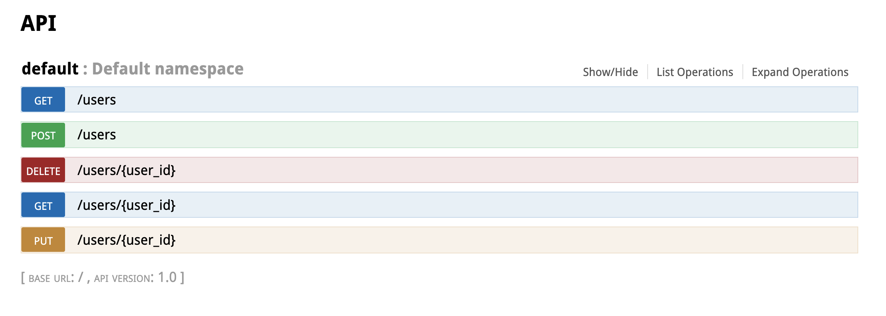
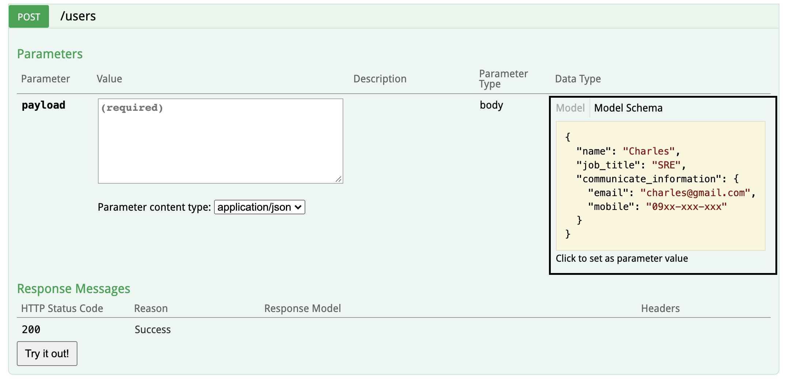
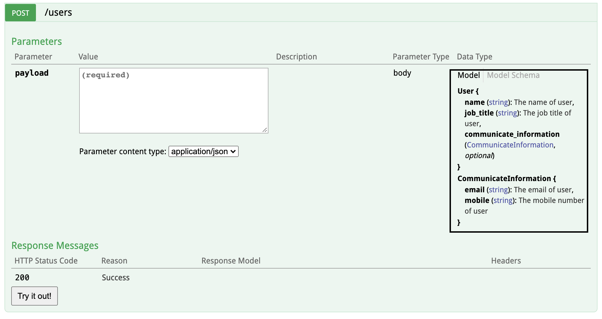
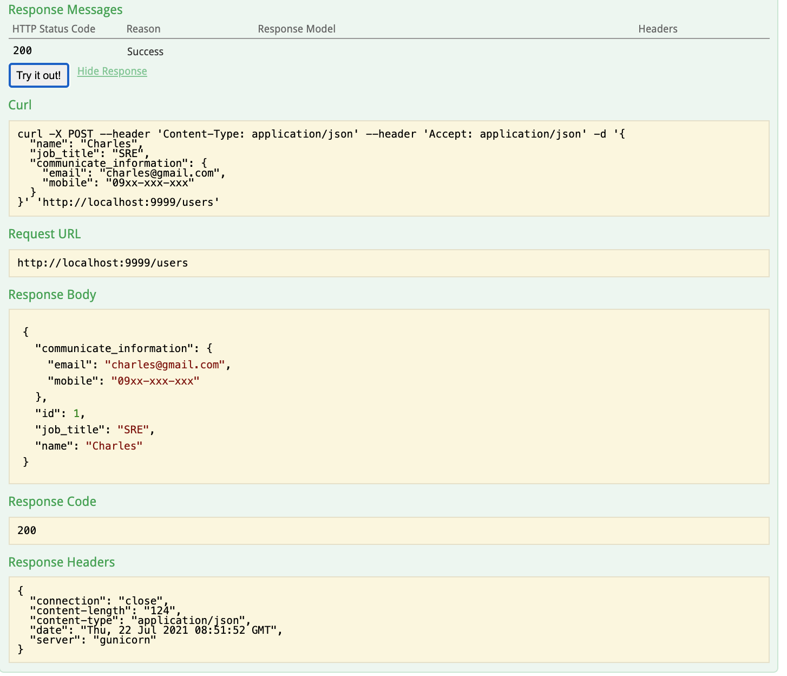

# Restful-Api-Using-Flask
created by Jack Kuo(whane601@gmail.com)

## Introduction
- A Restful Api provided to CRUD User, User information structure example:
```
{
  "name": "Charles",
  "job_title": "SRE",
  "communicate_information": {
    "email": "charles@gmail.com",
    "mobile": "09xx-xxx-xxx"
  }
}
```
- Use `Dockerfile` and `docker-compose.yml` to containerize app
- Use some pydantic skills to check api request information is available and as expected, see in [app/app.py#L35](https://github.com/whane601/restful-api-using-flask/blob/develop/app/app.py#L35) and [app/app.py#L55](https://github.com/whane601/restful-api-using-flask/blob/develop/app/app.py#L55)
- All docker-compose configs is in `deploy/.env` and app configs is in `deploy/config.yaml`
- Use `sqlalchemy` to connect `sqlite` database and save all users information in that

## Quick Start
### Steps 1:
- Modify `deploy/.env` file to set up `docker-compose` config

### Steps 2:
- Modify `deploy/config.yaml` file to set up app config

### Steps 3:
- Run command
```
cd deploy
docker-compose up
```
- The containerized app now is run in the local

## Swagger
- Suppose the `EXPORT_PORT` in `deploy/.env` is 9999
- Please visit the url: [http://localhost:9999/#/default](http://localhost:9999/#/default)
- You can see the all Apis the system provide

- Now, you can try it out! and swagger will hint at what request information is required


- See response data from api
